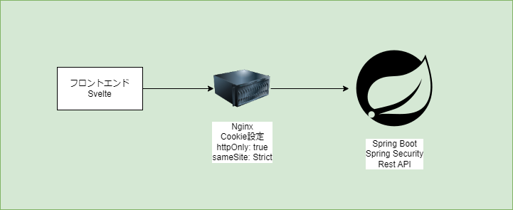

# 概要
* いつやるかは未定
* 以下段階を踏み勉強していく
    * SpringBootでHelloWorldを作り、リバースプロキシとしてNginxを設定
    * SpringBootにSpringSecurityでBasic認証を設定
    * NginxのCookie設定に`httpOnly: true`と`sameSite: strict`を設定
    * SpringSecurityにJWT認証を設定、認証情報はCookieに保存
    * SvelteでHelloWorld
    * Svelteでルーティング（認証画面、認証後表示画面、認証いらず画面）
    * 多言語対応

# 構成図
